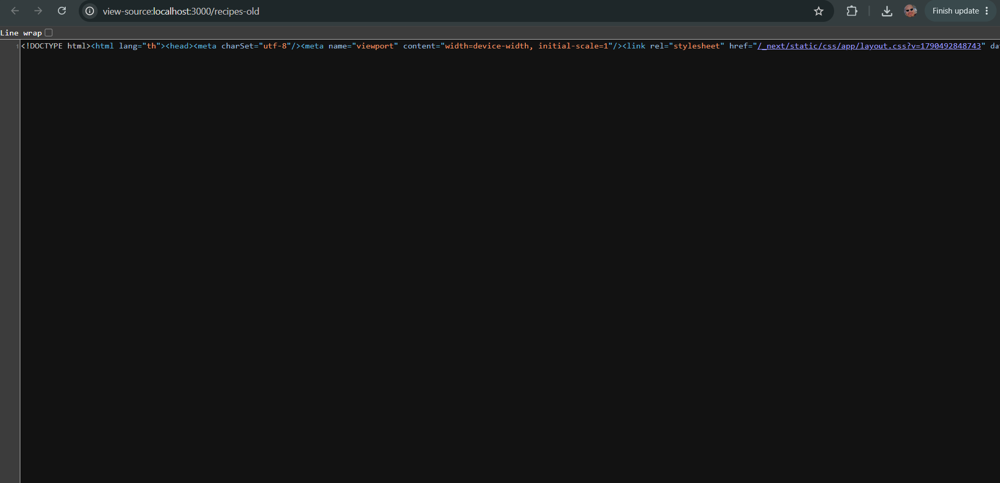
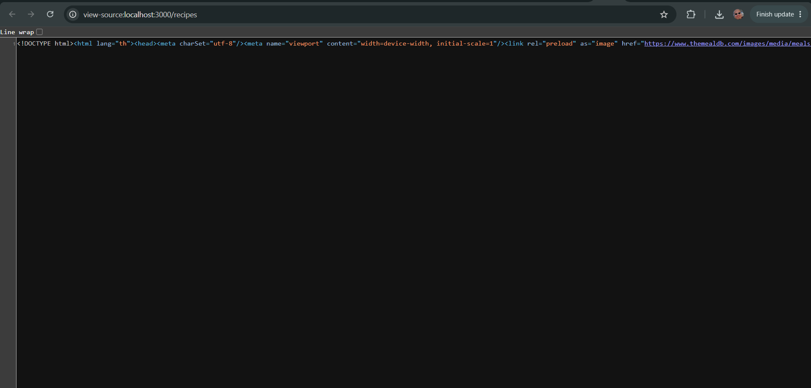
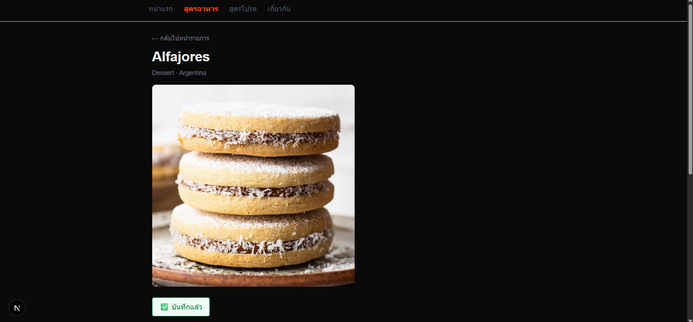
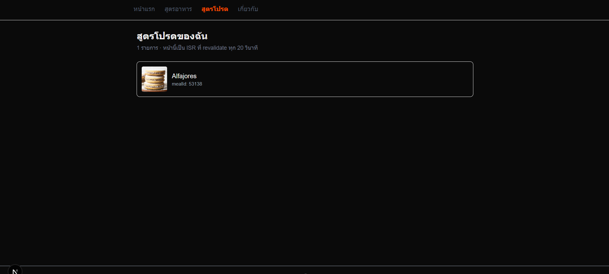

# `lab-day-07-start` — โปรเจกต์ตั้งต้นของแล็บบ่าย วันที่ 7

โครงตั้งต้นสำหรับ **Lab วันที่ 7 — 🎯 มินิแอป #4: Server-Fetched Recipes + Route Handler**
⏱ **Quiz 13:00–13:15 · Lab A 13:15–14:05 · Lab B 14:05–14:50 · Explain-Back 14:50–15:00**
โจทย์เต็มอยู่ในไฟล์นี้ (หัวข้อ "โจทย์" ด้านล่าง) — โฟลเดอร์นี้คือ**ที่ที่ต้องเขียนโค้ดและส่งงาน**

> 🎯 **มินิแอปหมุดหมายชิ้นที่ 4 จาก 5** — คะแนนแล็บวันนี้คูณ **×1.5**
> 🔖 **15 นาทีแรกเป็น Quiz** ทำคนเดียว ปิดจอ ห้าม AI — อย่าเพิ่งเปิดโปรเจกต์
> 📸 **ต้องแคป Network tab 2 ภาพใส่ README** เป็นหลักฐาน `revalidate` — ต้องรอเวลาจริง ทำให้เสร็จก่อนนาทีสุดท้าย
> 🔓 AI ใช้ได้ตามกติกาปกติ — อธิบายทุกบรรทัดได้เมื่อ TA ถาม

นี่คือโปรเจกต์เดียวกับเช้านี้ (สถานะตอน ✅ #4) — `/recipes` เป็น Server Component แล้ว · `/recipes-old` คือเวอร์ชัน client-fetch เดิม **ห้ามลบ**

---

## เริ่มยังไง

```bash
npm install
npm run dev     # http://localhost:3000 — ต้องเป็น port 3000 เท่านั้น
```

| ปัญหา | ทางแก้ |
|---|---|
| `/recipes/52772` ขึ้น `The default export is not a React Component` | ไฟล์ `app/recipes/[id]/page.jsx` ยังว่าง — งาน Lab A |
| `/api/my-recipes` ขึ้น `405` | `route.js` ยังว่าง หรือชื่อฟังก์ชันไม่ใช่ `GET`/`POST` ตัวพิมพ์ใหญ่ล้วน |
| `fetch failed` ใน terminal | dev server ไม่ได้อยู่ที่ port 3000 |
| ตั้ง `revalidate` แล้วหน้าอัปเดตทันที | เอาติ๊ก **Disable cache** ใน DevTools ออก และอย่า hard reload (Cmd/Ctrl+Shift+R) — ในโหมด dev สองอย่างนี้ข้าม cache ของ Next.js ไปเลย |
| รอครบ N วิแล้ว refresh ยังไม่เห็นรายการใหม่ | refresh อีกครั้ง — ครั้งแรกหลังหมดเวลา Next.js ยังส่งของเก่ามาก่อน แล้วค่อยไปเอาของใหม่เบื้องหลัง |

---

## ไฟล์ที่ต้องเขียน

```
app/
├── recipes/
│   ├── page.jsx                ✓ เสร็จจากเช้า (Server Component)
│   └── [id]/
│       ├── page.jsx            ← Lab A a) + c) · Lab B c) วางปุ่ม
│       └── not-found.jsx       ← (ไม่บังคับ) สร้างเอง
├── recipes-old/page.jsx        ✓ ห้ามลบ
├── my-recipes/page.jsx         ← Lab B d) แก้ให้ fetch /api/my-recipes + revalidate
└── api/
    ├── recipes/route.js        ✓ ของเช้า — ห้ามใช้ซ้ำเป็นงานบ่ายนี้
    └── my-recipes/route.js     ← Lab B b)
components/
├── RecipeCard.jsx              ← Lab A b) ครอบด้วย <Link>
└── AddFavoriteButton.jsx       ← Lab B c) (Client Component)
lib/data/
├── my-recipes.json             ← Lab B a) สร้างเอง
└── my-recipes.js               ← Lab B a)
README.md                       ← Lab A d) + Lab B d) e) (ภาพ + คำอธิบาย) — เขียนต่อท้ายไฟล์นี้
```

### ⚠️ ต่างจากสคริปต์ — `await connection()`

`/demo`, `/my-recipes` มีบรรทัด `await connection()` ที่ไม่มีในสคริปต์เช้า — ใส่ไว้เพื่อให้ `npm run build` ไม่พัง (ตอน build ยังไม่มี server ที่ `localhost:3000` ให้ fetch) ไม่ได้เปลี่ยนพฤติกรรม cache ของ `fetch` · ตอนแก้ `/my-recipes` ให้เก็บบรรทัดนี้ไว้

---

# โจทย์

## Lab A (50 น. · 13:15–14:05) — เติม detail page ให้เป็น Server Component

📁 **สถานะตอนเข้าคาบ (ทำเสร็จแล้วตอนเช้า — TA เช็กว่าทุกกลุ่มมีจริงก่อนเริ่ม)**
```
app/
├── recipes/
│   └── page.jsx          # ✓ Server Component แล้ว — await fetch ตรง ๆ ไม่มี "use client"
└── recipes-old/
    └── page.jsx           # ✓ ของเดิม — "use client" + useFetch (วันที่ 3) — ห้ามลบ ใช้เทียบ
```

**สิ่งที่ยังไม่มี และเป็นงานของ Lab A วันนี้:** หน้ารายละเอียดสูตรอาหาร (`/recipes/[id]`) เช้านี้ทำแค่หน้ารายการ ยังไม่มีหน้า detail เลย — บ่ายนี้ต้องสร้างให้ครบ **list+detail** ตามที่โจทย์วันนี้ต้องการ

### a) สร้าง `app/recipes/[id]/page.jsx` เป็น Server Component ใหม่ทั้งไฟล์

- [ ] ดึงข้อมูลด้วย `await fetch(...)` ตรง ๆ ใน component (ไม่มี `"use client"`, ไม่มี `useEffect`/`useState`)
- [ ] ใช้ TheMealDB `lookup.php?i={id}` ดึงสูตรตาม id
- [ ] ⚠️ **Next.js 15 — `params` เป็น Promise ต้อง `await` ก่อนอ่านค่า** (`const { id } = await params`) ต่างจาก Next.js เวอร์ชันก่อนหน้าที่อ่านค่าตรง ๆ ได้เลย
- [ ] แสดงรูป ชื่อ หมวดหมู่ และวิธีทำ
- [ ] 🆕 **แสดงรายการวัตถุดิบพร้อมปริมาณ** เช่น `3/4 cup · soy sauce` และหัวข้อบอกจำนวน `วัตถุดิบ (9 อย่าง)` — ⚠️ TheMealDB **ไม่ได้ให้ ingredients มาเป็น array** แต่ให้เป็น field แบน ๆ 20 คู่ (`strIngredient1`…`strIngredient20` + `strMeasure1`…`strMeasure20`) ต้องแปลงเป็น array เอง แล้วตัดช่องที่ว่างทิ้ง (เปิด `lookup.php?i=52772` ดูใน browser ก่อนเขียน — ช่องว่างไม่ได้หน้าตาแบบเดียว)

### b) เชื่อมการ์ดในหน้ารายการให้ลิงก์ไปหน้า detail

- [ ] แก้ `components/RecipeCard.jsx` ให้ครอบด้วย `next/link` ไปที่ `/recipes/${recipe.idMeal}`
- [ ] ใช้ `recipe.idMeal` เป็นทั้ง `key` ในลิสต์ และเป็นค่าที่ส่งเป็น URL param (ตามแพทเทิร์นวันที่ 4)

### c) จัดการกรณี id ไม่มีอยู่จริง

- [ ] ⚠️ **TheMealDB ตอบ "ไม่พบ" ได้มากกว่า 1 หน้าตา และไม่มีแบบไหนเป็น array ว่าง** — ลองเปิด `lookup.php?i=99999` กับ `lookup.php?i=xxxxx` ตรง ๆ ใน browser เทียบกัน แล้วเขียนเงื่อนไขที่รอดทั้งสองแบบ (`meals?.[0]` อย่างเดียว**ไม่พอ**)
- [ ] เรียก `notFound()` จาก `next/navigation` เมื่อไม่พบสูตร แทนที่จะปล่อยให้หน้าเว็บ error 500 หรือจอขาว

### d) เขียนเปรียบเทียบ client fetch เดิม vs server fetch ใหม่ ลง `README.md`

นี่คือส่วนที่ตรงกับเกณฑ์ "อธิบาย/แสดงความต่างกับเวอร์ชัน client fetch เดิมได้" — ต้องมีทั้งภาพและคำอธิบาย ไม่ใช่แค่พูดปากเปล่าตอน TA ถาม

- [ ] เปิด `/recipes-old` แล้วกด **View Page Source** (ไม่ใช่ Inspect Element) — แคปให้เห็นว่า HTML ที่ได้มา **ไม่มีข้อมูลสูตรอาหารอยู่เลย** มีแต่ shell เปล่า ๆ ที่รอ JS ทำงานต่อ
- [ ] เปิด `/recipes` แล้วกด View Page Source อีกครั้ง — แคปให้เห็นว่า HTML ที่ได้มา **มีข้อมูลสูตรอาหารฝังอยู่ในเอกสารตั้งแต่แรก**
- [ ] เขียนอธิบาย 3–5 บรรทัด: ทำไม `/recipes-old` ต้องมี 2 รอบ paint (component mount → spinner → fetch เสร็จ → re-render) ในขณะที่ `/recipes` ไม่ต้องรอรอบสองเลย

### สิ่งที่ต้องได้ตอนจบ Lab A

```
☐ /recipes ยังเป็น Server Component เหมือนเดิม ไม่มี spinner (ทำเสร็จจากเช้า)
☐ /recipes/[id] เป็น Server Component ใหม่ ไม่มี spinner เลยแม้แต่เสี้ยววินาที
☐ กดการ์ดจากหน้ารายการ → ไปหน้ารายละเอียดถูกสูตร
☐ หน้า detail มีรายการวัตถุดิบ + ปริมาณ ไม่มีบรรทัดว่าง/บรรทัด "null" หลุดมา และจำนวนในหัวข้อตรงกับจำนวนบรรทัด
☐ พิมพ์ /recipes/99999 และ /recipes/xxxxx (id ปลอม 2 แบบ) ตรง ๆ ในแถบที่อยู่ → ขึ้นหน้า "ไม่พบสูตรนี้" ทั้งคู่ ไม่ใช่จอขาว/หน้าเปล่า/error 500
☐ /recipes-old ยังใช้งานได้ปกติ (ห้ามลบ ใช้เป็นตัวเทียบ)
☐ README มีภาพ View Page Source ทั้งคู่ + คำอธิบายความต่าง
```

📁 โครงไฟล์ที่ควรได้ตอนจบ Lab A:
```
app/
├── recipes/
│   ├── page.jsx            # (เช้านี้) Server Component list
│   └── [id]/
│       ├── page.jsx        # ★ ใหม่วันนี้ — Server Component detail
│       └── not-found.jsx   # (ไม่บังคับ) ข้อความ "ไม่พบสูตรนี้" เฉพาะ segment นี้
├── recipes-old/
│   └── page.jsx            # ห้ามลบ — เวอร์ชันเทียบ
components/
└── RecipeCard.jsx           # แก้ให้ครอบด้วย <Link>
```

---

## Lab B (45 น. · 14:05–14:50) — Route Handler ของตัวเอง 🎯

> 🎤 *"เช้านี้เราดึงจาก TheMealDB ตลอด — API สาธารณะที่อ่านได้อย่างเดียว ยิง POST เพิ่มอะไรเข้าไปไม่ได้ บ่ายนี้แต่ละกลุ่มต้องเขียน API endpoint ของตัวเอง เก็บ 'สูตรโปรด' ที่กดบันทึกจากหน้ารายละเอียด แก้ไขข้อมูลได้จริงเพราะเป็นของกลุ่มเอง"*

⚠️ **ห้าม copy `/api/recipes` จากเช้านี้มาใช้ตรง ๆ** — วันนี้ต้องเป็น endpoint ใหม่ที่ path/ข้อมูลแยกจากเช้า (`/api/my-recipes` เก็บ "สูตรโปรด" ของผู้ใช้ ไม่ใช่รายชื่อสูตรอาหารทั้งหมดแบบเช้านี้) ดูรายละเอียดเหตุผลใน Twist ข้อ 3

### a) สร้าง data store ของตัวเอง

- [ ] `lib/data/my-recipes.json` — เริ่มต้นเป็น array ว่าง `[]`
- [ ] `lib/data/my-recipes.js` — copy เป็นตัวแปรในหน่วยความจำ (แพทเทิร์นเดียวกับเช้านี้ แต่คนละไฟล์ คนละ array กับ `lib/data/recipes.js` ของเช้า)

### b) เขียน `app/api/my-recipes/route.js`

- [ ] `GET(request)` — คืนลิสต์สูตรโปรดทั้งหมดเป็น JSON
- [ ] 🆕 `GET` รองรับ `?q=คำค้น` — กรองตามชื่อแบบไม่สนตัวพิมพ์เล็ก/ใหญ่ (`?q=CHICKEN` ต้องเจอ `Teriyaki Chicken Casserole`) · ไม่ส่ง `q` = คืนทั้งหมด
- [ ] `POST(request)` — รับ `{ mealId, name, thumb }` แล้วเพิ่มเข้า store ตอบ `201` พร้อมรายการที่เพิ่งสร้าง
- [ ] 🔴 **POST ต้องตอบ error เองให้ครบ 3 กรณี ห้ามมีกรณีไหนหลุดไปเป็น 500 ที่ Next.js ตอบเอง** — ทุกกรณีต้องมี `{ error: "..." }` ที่อ่านรู้เรื่อง:

  | กรณี | status |
  |---|:--:|
  | body ไม่ใช่ JSON เลย (เช่น `-d 'hello'` หรือไม่ส่ง body) | `400` |
  | เป็น JSON แต่ไม่มี `mealId` หรือ `name` | `400` |
  | `mealId` นี้อยู่ในรายการโปรดแล้ว | `409` |

  (ต้องอธิบายได้ว่าทำไมกรณีสุดท้ายไม่ใช่ `400`)
- [ ] ใช้ `NextResponse.json(...)` (import จาก `next/server`) ไม่ใช่ `res.send`/`res.status` แบบ Express หรือ Pages Router เก่า

### c) ปุ่ม "เพิ่มในสูตรโปรด" ที่หน้า detail

- [ ] สร้าง `components/AddFavoriteButton.jsx` เป็น **Client Component** (`"use client"`) — มี `onClick` ต้องเป็น client เท่านั้น
- [ ] กดแล้วยิง `POST` ไปที่ `/api/my-recipes` ของตัวเอง พร้อมแสดงสถานะ (กำลังบันทึก/บันทึกแล้ว/error)
- [ ] 🆕 ถ้า POST ไม่สำเร็จ ต้องแสดง **error message ที่ Route Handler ของตัวเองส่งกลับมา** ใต้ปุ่ม ไม่ใช่ข้อความที่เขียนตายตัวไว้ในปุ่ม
- [ ] 🆕 กดปุ่มกับสูตรที่อยู่ในรายการโปรดแล้ว (เช่น refresh หน้า detail แล้วกดซ้ำ) → **ไม่ขึ้น ❌** แต่ขึ้นว่าเพิ่มไว้แล้ว — จากมุมผู้ใช้ `409` ไม่ใช่ความล้มเหลว
- [ ] วางปุ่มนี้ไว้ใน `app/recipes/[id]/page.jsx` (Server Component) ที่สร้างจาก Lab A — ส่ง `mealId`/`name`/`thumb` เป็น props ลงไป

### d) หน้าแสดงสูตรโปรด — ตั้ง `revalidate`

- [ ] สร้าง `app/my-recipes/page.jsx` เป็น Server Component ที่ `fetch` จาก `/api/my-recipes` ของตัวเอง
- [ ] 🔴 **ต้องใส่ `{ next: { revalidate: N } }` อย่างชัดเจน** (เลือกค่า N เอง เช่น 15–30 วินาที) ห้ามปล่อยเป็นค่าเริ่มต้นเฉย ๆ
- [ ] เขียนเหตุผล 2–3 บรรทัดใน README ว่าทำไมเลือก ISR (ไม่ใช่ SSR หรือ SSG) สำหรับ route นี้ — ตรงกับเกณฑ์ "อธิบายได้ว่าทำไมเลือก SSR/SSG/ISR สำหรับ route นี้"

### e) พิสูจน์ `revalidate` ด้วย Network tab

- [ ] เปิด `/my-recipes` → ดู response แรกใน DevTools Network tab → จดจำนวนรายการที่เห็น
- [ ] กดปุ่มเพิ่มสูตรโปรดใหม่ 1 รายการจากหน้า detail
- [ ] **Refresh `/my-recipes` ทันที (ก่อนครบ N วินาที)** → **แคปหน้าจอ #1**: ต้องยังไม่เห็นรายการใหม่ (ใช้ cache เดิม)
- [ ] **รอเกิน N วินาทีแล้ว refresh อีกครั้ง** → **แคปหน้าจอ #2**: ต้องเห็นรายการใหม่แล้ว
- [ ] วางภาพทั้ง 2 ใบ (มี timestamp ต่างกันชัดเจนใน Network tab) ลง README ตามเทมเพลตในหัวข้อ "README ที่ต้องเขียน" ท้ายไฟล์นี้

---

## Twist

1. 🔴 **Route Handler ต้องไม่มีทางตอบ 500** — TA จะยิง `curl` สด 3 นัดที่เครื่องกลุ่ม: body `{}` → ต้อง `400` · body `hello` (ไม่ใช่ JSON) → ต้อง `400` · POST `mealId` เดิมซ้ำสองครั้ง → ครั้งที่สองต้อง `409` · ทุกนัดต้องมี error message ที่อ่านรู้เรื่อง
2. 🔴 **ต้องพิสูจน์ด้วยภาพว่า `revalidate` ทำงานจริง ไม่ใช่แค่เขียนโค้ดแล้วอ้างว่าใช้ได้** — สกรีนช็อต 2 ใบใน README ต้องมี timestamp ของ Network tab ต่างกันจริง ไม่ใช่ภาพเดียวกันวางซ้ำ หรือภาพที่ไม่เห็นเวลา
3. 🔴 **ห้ามใช้ path `/api/recipes` ซ้ำกับของเช้า** — ต้องเป็น `/api/my-recipes` (หรือชื่ออื่นที่ TA อนุมัติ) ผูกกับ data store แยกไฟล์ต่างหาก แล้วอธิบายได้ว่าทำไมสองอย่างนี้ควรแยกกัน (รายชื่อสูตรทั้งหมดจาก TheMealDB vs สูตรโปรดที่ผู้ใช้กดเพิ่มเอง — คนละความหมาย คนละวงจรชีวิตข้อมูล)
4. 🔴 **หน้า detail ต้องจัดการกรณี id ไม่มีอยู่จริงด้วย `notFound()`** ไม่ใช่ปล่อยให้ error 500 เต็มหน้า จอขาว หรือหน้าเปล่า — TA จะเข้า**ทั้ง** `/recipes/99999` **และ** `/recipes/xxxxx` ต้องเห็นหน้าที่อ่านรู้เรื่องทั้งคู่ (สองอันนี้ทำให้ TheMealDB ตอบคนละแบบ — ผ่านอันเดียวไม่นับ)

---

## เกณฑ์ให้คะแนนวันนี้

**Lab A (pass/fail — ผ่านครบ = 60% · ไม่ผ่านแม้ข้อเดียว = 0)**
- [ ] หน้า list+detail ดึงข้อมูลฝั่ง server สำเร็จ ไม่มี client-side loading spinner ที่ไม่จำเป็น
- [ ] อธิบาย/แสดงความต่างกับเวอร์ชัน client fetch เดิมได้

**Lab B (คุณภาพ — 40%)**
- Route Handler ทำงานถูกต้องตามสเปก (method, response format) — **40%**
- ตั้ง `revalidate` แล้วพิสูจน์ผลจริงผ่าน Network tab (แนบหลักฐาน) — **40%**
- อธิบายได้ว่าทำไมเลือก SSR/SSG/ISR สำหรับ route นี้ — **20%**

> คะแนนรวมของวันนี้คูณ **×1.5** (วันหมุดหมาย)
> ⚠️ **"detail ดึงข้อมูลฝั่ง server สำเร็จ" หมายถึงหน้า detail ครบตามกล่อง "สิ่งที่ต้องได้ตอนจบ Lab A"** — รวมรายการวัตถุดิบ และ `notFound()` ทั้ง `/recipes/99999` กับ `/recipes/xxxxx` · วัตถุดิบมีแต่ยังมีบรรทัดว่าง/`null` หลุด 1–2 บรรทัด = ให้แก้หน้างานแล้วผ่านได้ถ้าแก้ทันก่อน 14:05 · ไม่มีรายการวัตถุดิบเลย = ข้อนี้ไม่ผ่าน

## ก่อนส่ง — Twist ที่ TA จะลองกับเครื่องคุณ

- [ ] `curl -i` 3 นัด ทุกนัดต้องมี error ที่อ่านรู้เรื่อง ไม่ใช่ 500:
  ```bash
  curl -i -X POST http://localhost:3000/api/my-recipes -H "Content-Type: application/json" -d '{}'      # → 400
  curl -i -X POST http://localhost:3000/api/my-recipes -H "Content-Type: application/json" -d 'hello'   # → 400
  curl -i -X POST http://localhost:3000/api/my-recipes -H "Content-Type: application/json" -d '{"mealId":"52772","name":"Teriyaki Chicken Casserole"}'   # ยิง 2 ครั้ง → ครั้งที่สอง 409
  ```
- [ ] `curl "http://localhost:3000/api/my-recipes?q=CHICKEN"` → กรองได้แม้ตัวพิมพ์ต่างกัน
- [ ] กดปุ่มเพิ่มกับสูตรที่เพิ่มไว้แล้ว → ไม่ขึ้น ❌
- [ ] README มีภาพ Network tab 2 ใบ timestamp ต่างกันจริง (ก่อน / หลังครบ N วิ)
- [ ] ใช้ path `/api/my-recipes` + data store แยกไฟล์ — อธิบายได้ว่าทำไมต้องแยกจาก `/api/recipes`
- [ ] `/recipes/99999` **และ** `/recipes/xxxxx` → หน้าที่อ่านรู้เรื่องผ่าน `notFound()` ทั้งคู่

---

## README ที่ต้องเขียน (เติมต่อท้ายไฟล์นี้)

```markdown
## เปรียบเทียบ client fetch เดิม vs server fetch ใหม่
### /recipes-old — View Page Source

### /recipes — View Page Source

(อธิบาย 3–5 บรรทัด)

## หลักฐาน revalidate ที่ /my-recipes (revalidate: N)
### ก่อนครบ N วินาที

### หลังครบ N วินาที


## ทำไมเลือก SSR / SSG / ISR สำหรับ /my-recipes
(2–3 บรรทัด)
```

---

# 📝 คำตอบของกลุ่ม

## 👥 สมาชิกกลุ่ม

| ชื่อ–นามสกุล | รหัสนักศึกษา |
|---|---|
| กันต์ธีภพ ปันพรม | 682110160 |
| พันธวีร์ ธรรมคุณ | 682110183 |
| สัฏฐี ทำทอง | 682110197 |

---

## เปรียบเทียบ client fetch เดิม vs server fetch ใหม่

### /recipes-old — View Page Source


### /recipes — View Page Source


**ตัวเลขที่วัดได้จริง** (ขนาด HTML ที่เซิร์ฟเวอร์ส่งออกมา ก่อน JS ทำงาน):

| | `/recipes-old` (client fetch) | `/recipes` (server fetch) |
|---|---:|---:|
| ขนาด HTML | 13,884 bytes | 389,581 bytes |
| จำนวนรูปสูตรอาหารใน HTML | **0** | **676** |
| คำว่า "กำลังโหลด" ใน HTML | **1** | 0 |

**คำอธิบาย**

`/recipes-old` เป็น Client Component — HTML ที่เซิร์ฟเวอร์ส่งมามีแต่โครงเปล่ากับคำว่า "กำลังโหลด..."
ไม่มีชื่อหรือรูปสูตรอาหารสักอัน เพราะตอนเซิร์ฟเวอร์เรนเดอร์ `useFetch` ยังไม่ได้ทำงานเลย
เบราว์เซอร์จึงต้อง **paint 2 รอบ**: รอบแรกวาด spinner ทันทีที่ component mount → แล้ว `useEffect`
จึงเริ่มยิง fetch ไป TheMealDB → พอข้อมูลกลับมา `setState` ทำให้ re-render → รอบสองถึงวาดการ์ดจริง
ระหว่างสองรอบนี้ผู้ใช้เห็นจอโหลดค้าง และ request ไป TheMealDB เพิ่งเริ่มนับหนึ่งหลัง JS โหลดเสร็จแล้วเท่านั้น

`/recipes` เป็น Server Component — `await fetch(...)` ทำงานจบบนเซิร์ฟเวอร์ **ก่อน** ส่ง HTML ออกมา
ข้อมูลทั้ง 676 รูปจึงฝังอยู่ในเอกสารตั้งแต่ byte แรกที่เบราว์เซอร์ได้รับ paint รอบเดียวก็เห็นของครบ
ไม่มี spinner ไม่มีรอบสอง และ HTML นี้อ่านได้ด้วย View Page Source โดยไม่ต้องรัน JS เลย

---

## ปุ่ม "เพิ่มในสูตรโปรด" ทำงานจริง (Lab B c)

### กดปุ่มที่หน้า detail → POST /api/my-recipes ตอบ 201


ปุ่มเปลี่ยนเป็น "✅ บันทึกแล้ว" หลัง Route Handler ของกลุ่มตอบ `201 Created`

### รายการโผล่ที่ /my-recipes


Alfajores (mealId 53138) ที่เพิ่งกดเพิ่ม ขึ้นมาในหน้าสูตรโปรดเรียบร้อย

---

## หลักฐาน revalidate ที่ /my-recipes (revalidate: 20)

### ก่อนครบ 20 วินาที


### หลังครบ 20 วินาที


**ลำดับเหตุการณ์ที่วัดได้จริง** (นาฬิกาเครื่อง):

```
13:50:21  โหลด /my-recipes ครั้งแรก          → หน้าเว็บแสดง 0 รายการ
13:50:22  POST /api/my-recipes เพิ่ม 1 รายการ → API ตอบ 201
13:50:22  GET  /api/my-recipes                → API มี 1 รายการแล้ว
13:50:22  refresh /my-recipes ทันที           → หน้าเว็บยังแสดง 0 รายการ  ← cache เดิม
13:50:59  (ผ่านไป 37 วิ) refresh ครั้งที่ 1    → ยังแสดง 0 รายการ  ← stale-while-revalidate
13:50:59  refresh ครั้งที่ 2                  → แสดง 1 รายการ  ← ของใหม่มาแล้ว
```

จุดสำคัญ: refresh ครั้งแรก**หลัง**หมดอายุยังได้ของเก่า เพราะ Next.js ส่ง cache เดิมออกไปก่อน
แล้วค่อยไป fetch ของใหม่มาเก็บไว้เบื้องหลัง — ผู้ใช้คนถัดไปถึงจะได้ของใหม่ (stale-while-revalidate)
นี่คือเหตุผลที่ต้อง refresh สองครั้ง ไม่ใช่ว่า `revalidate` ไม่ทำงาน

---

## ทำไมเลือก SSR / SSG / ISR สำหรับ /my-recipes

เลือก **ISR** (`{ next: { revalidate: 20 } }`)

**ทำไมไม่ใช่ SSG** — SSG เรนเดอร์ครั้งเดียวตอน build แล้วแช่ไว้ถาวร แต่สูตรโปรดเป็นข้อมูลที่ผู้ใช้
กดเพิ่มได้ตลอดเวลาหลัง build ไปแล้ว ถ้าใช้ SSG หน้านี้จะค้างอยู่ที่ "0 รายการ" ตลอดกาลจนกว่าจะ build ใหม่

**ทำไมไม่ใช่ SSR** — SSR ยิง fetch ใหม่ทุก request ได้ข้อมูลสดเสมอก็จริง แต่หน้านี้เป็นรายการโปรด
ส่วนตัวที่เปลี่ยนแค่ตอนผู้ใช้กดปุ่มเพิ่ม ซึ่งนาน ๆ ครั้ง การยิง API ใหม่ทุกครั้งที่มีคนเปิดหน้าจึงเป็นงานซ้ำ
ที่ได้ผลลัพธ์เดิม เปลืองทั้งเวลาตอบสนองและโหลดของ Route Handler โดยไม่ได้อะไรเพิ่ม

**ทำไม ISR ถึงพอดี** — ข้อมูลชุดนี้ยอม "ช้าได้นิดหน่อย" ผู้ใช้เห็นรายการที่เพิ่งเพิ่มช้าไป 20 วินาที
ไม่ได้สร้างความเสียหายอะไร แลกกับการที่ request ส่วนใหญ่ตอบจาก cache ได้ทันทีไม่ต้องรอ API
ISR จึงให้ทั้งความเร็วแบบ static และความสดในระดับที่ยอมรับได้ โดยไม่ต้อง build ใหม่

---

## ทำไม /api/my-recipes ต้องแยกจาก /api/recipes (Twist ข้อ 3)

| | `/api/recipes` (ของเช้า) | `/api/my-recipes` (ของบ่ายนี้) |
|---|---|---|
| ความหมาย | แคตตาล็อกสูตรอาหารทั้งหมด | สูตรที่ผู้ใช้กด "เพิ่มในสูตรโปรด" |
| ที่มาข้อมูล | ชุดข้อมูลอ้างอิง (TheMealDB) | การกระทำของผู้ใช้ |
| วงจรชีวิต | เปลี่ยนน้อย ใช้ร่วมกันทุกคน | เปลี่ยนบ่อย เป็นของผู้ใช้คนนั้น |
| data store | `lib/data/recipes.js` | `lib/data/my-recipes.js` |

ถ้ายัดสองอย่างนี้ลง endpoint เดียวกัน `GET` จะไม่รู้ว่าควรคืนแคตตาล็อกหรือรายการโปรด
ต้องใส่ flag แยกแขนงใน handler เดียว ซึ่งทำให้ validation ของ `POST` ปนกัน
(แคตตาล็อกต้องมี `category`, รายการโปรดต้องมี `mealId`) และกฎ "ห้ามซ้ำ" ที่ใช้ได้กับรายการโปรด
จะไปบังคับกับแคตตาล็อกด้วยทั้งที่ไม่ควร แยก path + แยก store ทำให้แต่ละฝั่งมีกฎของตัวเองชัดเจน

---

## ทำไม mealId ซ้ำถึงตอบ 409 ไม่ใช่ 400

`400 Bad Request` แปลว่า "คำขอเขียนมาผิดรูป" — client แก้ body แล้วยิงใหม่มีโอกาสผ่าน

แต่กรณี `mealId` ซ้ำ body ถูกต้องครบทุก field ไม่มีอะไรให้แก้เลย ปัญหาอยู่ที่ **สถานะปัจจุบันของ store**
ที่มี `mealId` นี้อยู่แล้ว ส่ง body เดิมซ้ำอีกกี่ครั้งก็ไม่มีวันผ่านจนกว่าจะไปลบรายการเดิมออกก่อน

`409 Conflict` สื่อตรงตัวว่า "คำขอชนกับสถานะที่มีอยู่" ซึ่งเป็นคนละสาเหตุกับ 400
ฝั่ง client จึงแยกการจัดการได้ถูก — ใน `AddFavoriteButton.jsx` เราเลยจับ 409 แยกจาก error อื่น
แล้วแสดงเป็น "✅ อยู่ในสูตรโปรดแล้ว" แทนที่จะขึ้น ❌ เพราะจากมุมผู้ใช้ ผลลัพธ์ที่ต้องการก็เกิดขึ้นแล้ว
